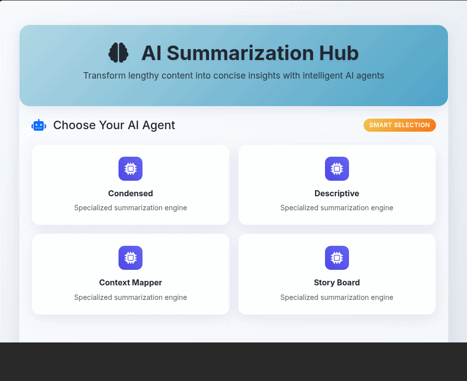
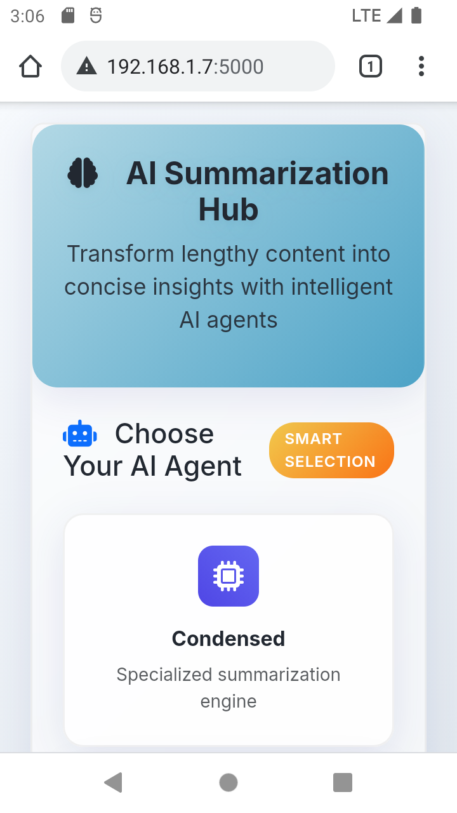
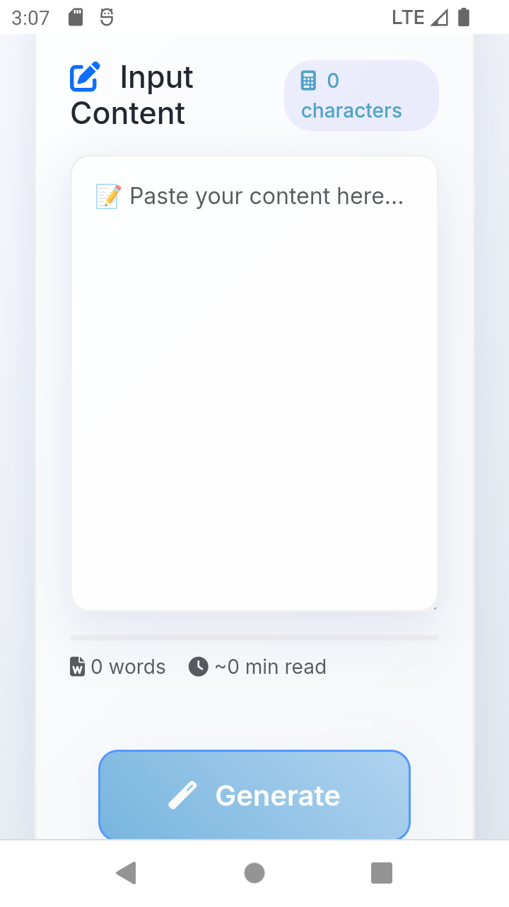
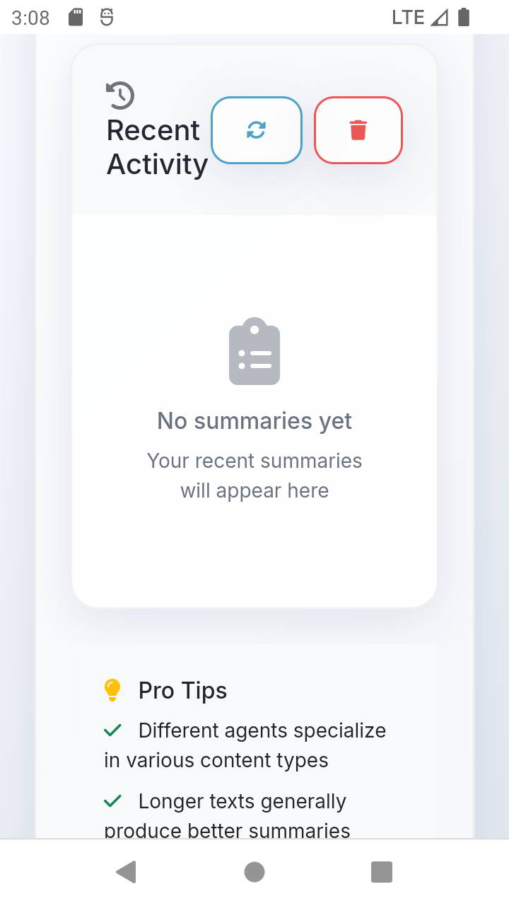

# Summarization-hub Application

Welcome to this Interactive Summarization Application! This repository contains the source code for a web-based application that allows users to learn and read and understand based custom LLM based agents, AI-powered agents for generating different narrative styles.

## Screenshots

### Desktop Interface


### Mobile Interface
  

## Directory Structure

```markdown
- .gitignore                      // Files/directories to ignore by Git
- LICENSE                        // License information for the project
- README.md                      // Project description and usage instructions
- agents/                        // Folder containing AI agents for storytelling
-- condensed_agent.py           // Generates condensed stories
-- context_agent.py             // Takes context into account when generating stories
-- descriptive_agent.py         // Focuses on providing detailed descriptions
-- reflective_agent.py          // Emphasizes introspective and emotional elements
-- storyboard_agent.py          // Generates a sequence of events in a linear fashion
-- you can add your own 	// create your prompt based on similar structure.
- app.py                        // Main application file
- static/                       // Static assets for the web application
-- index.css                    // CSS styling for the application
-- index.js                     // JavaScript logic for the application
- templates/                    // HTML templates for the web application
-- index.html                   // Main HTML template for the application
```

## Getting Started

To get started with this project, you will need to have Python 3 and a web server (such as Flask or Django) installed on your system. Install the required dependencies by running:

**Important** need local LLMs (e.g. ollama or llama.cpp based llm, server side)

```sh
pip install flask request
```

You can then run the application using:

```sh
python app.py
```

Visit `http://localhost:5000` in your web browser to access the application.

## Contributing

Contributions to this project are welcome! If you have any ideas for new features or improvements, please submit a pull request and include a description of the changes you've made. For more 
information on contributing, see the [contributing guidelines](CONTRIBUTING.md).

## License

This project is licensed under the terms of the [MIT License](LICENSE).

## Contact

If you have any questions or concerns regarding this project, please reach out to [pahuldeep singh](https://www.linkedin.com/in/pahuldeep/) at [@pahuldeep](pahuldeep100@gmail.com).

Happy coding!

